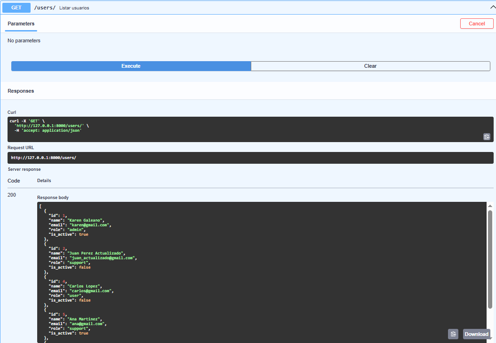
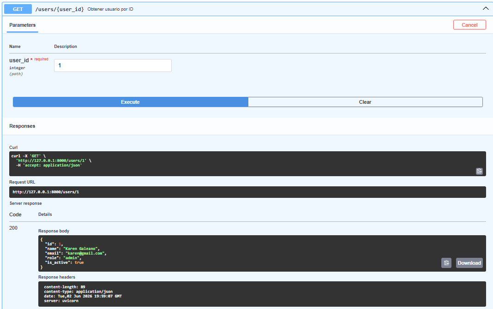
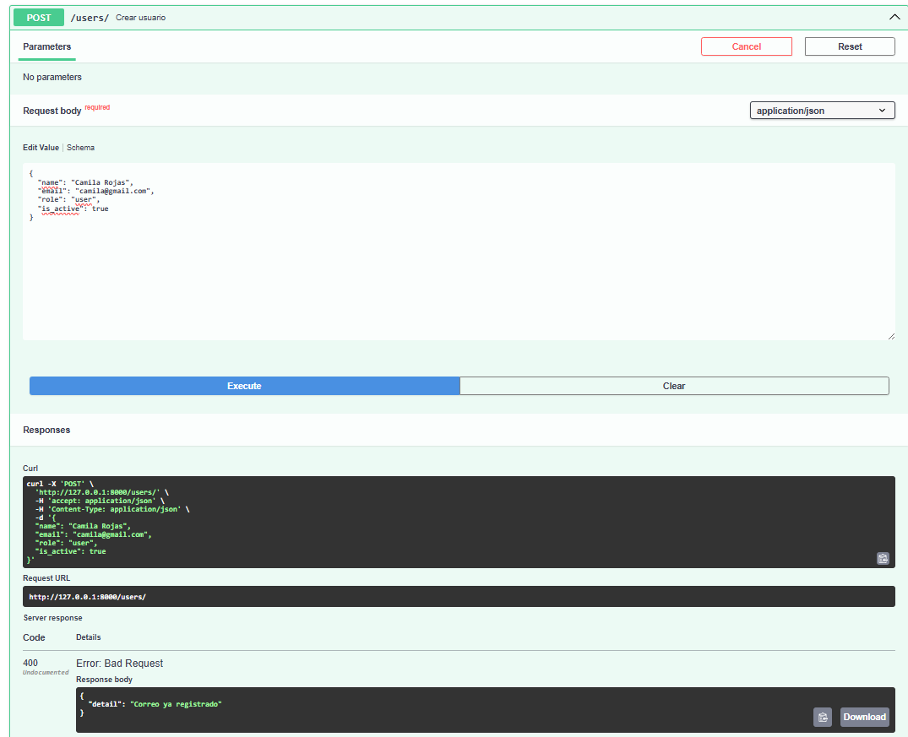
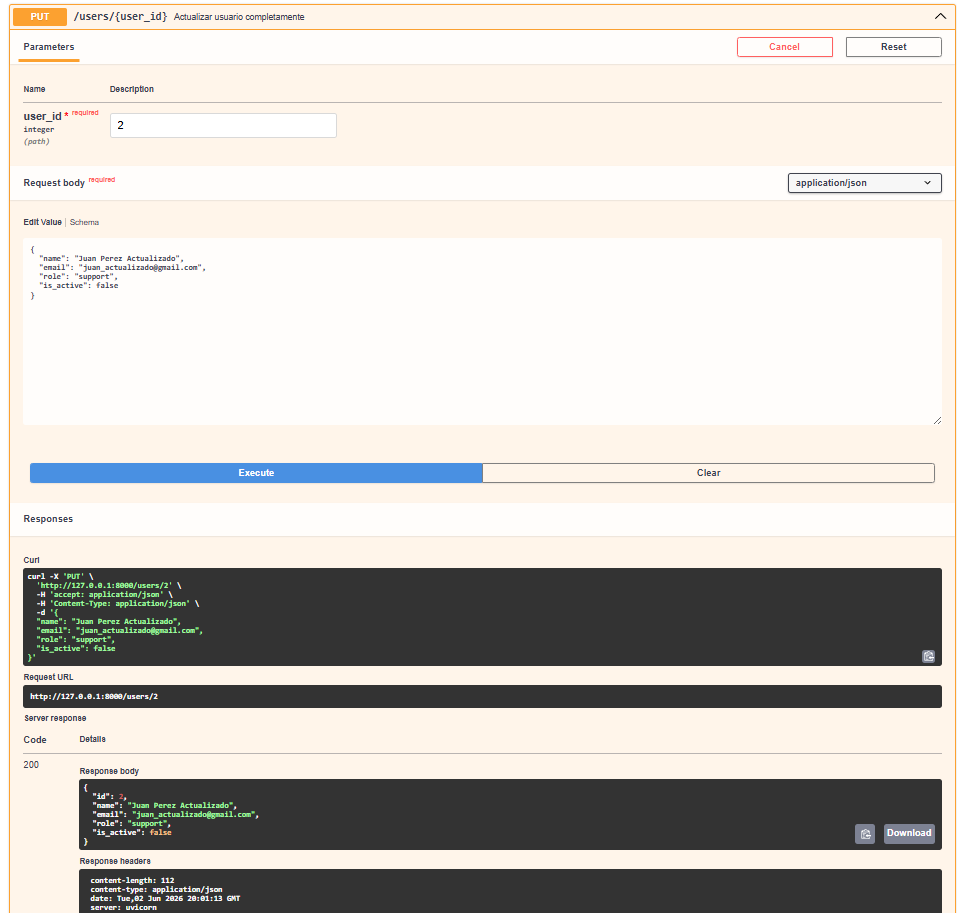
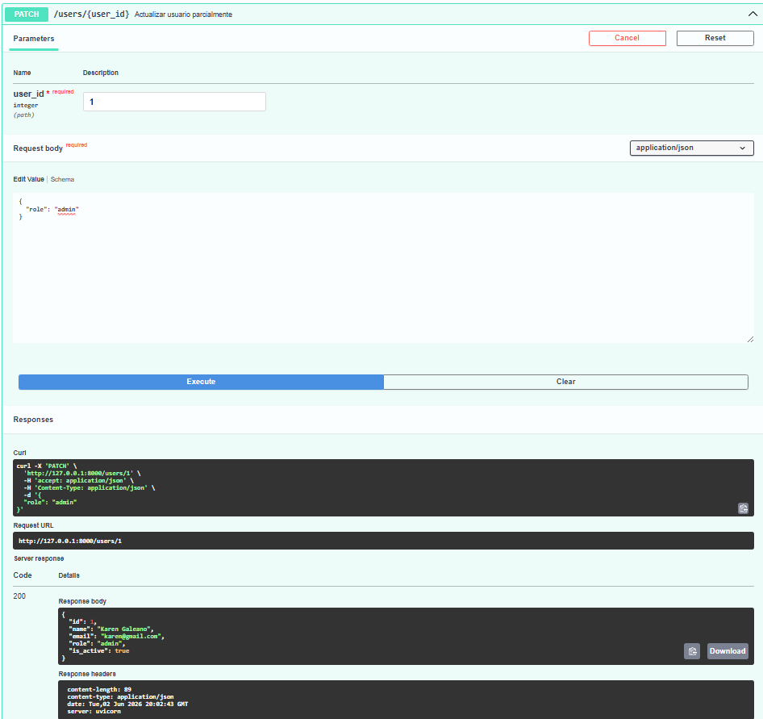
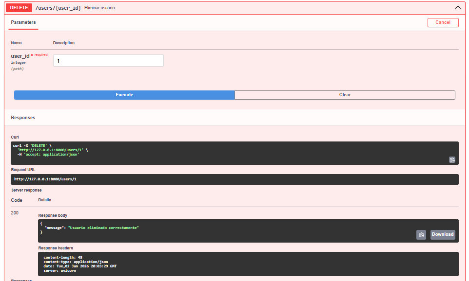
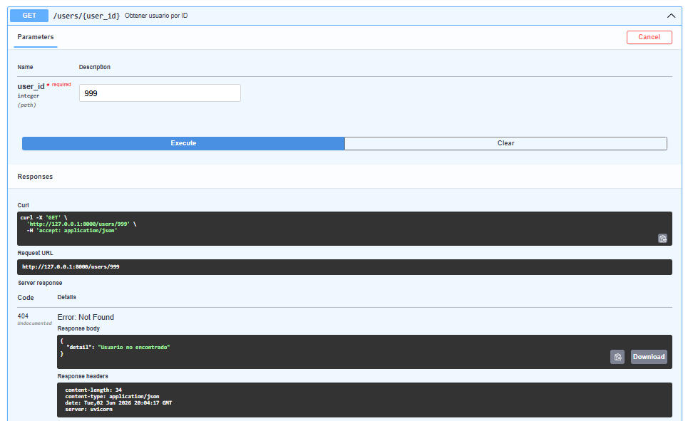
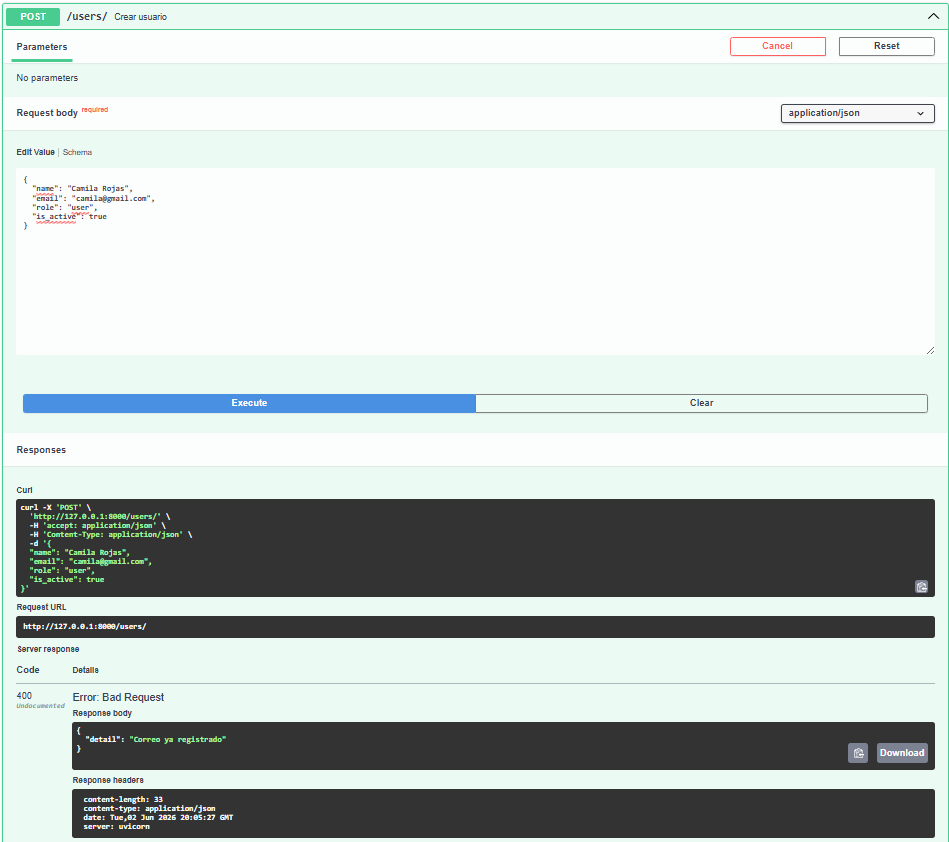

# 🚀 device_systems API

## 📖 Descripción

**device_systems** es una API REST desarrollada con **FastAPI** para la gestión de usuarios. Permite realizar operaciones CRUD completas sobre el recurso **users**, implementando validación de datos con Pydantic, manejo de errores mediante HTTPException, documentación automática con Swagger/OpenAPI y reutilización de lógica mediante Dependency Injection con Depends().

---

# 🎯 Objetivos del proyecto

- Implementar una API REST utilizando FastAPI.
- Aplicar operaciones CRUD completas.
- Validar datos mediante Pydantic.
- Utilizar códigos de estado HTTP adecuados.
- Implementar manejo de errores.
- Aplicar Dependency Injection con Depends().
- Generar documentación automática con Swagger y ReDoc.

---

# 🛠 Tecnologías utilizadas

- Python 3
- FastAPI
- Uvicorn
- Pydantic v2
- Swagger UI
- ReDoc
- Git
- GitHub

---

# 📂 Estructura del proyecto

```plaintext
device_systems/
│
├── app/
│
│   ├── main.py
│
│   ├── routes/
│   │   └── user_routes.py
│
│   ├── schemas/
│   │   └── user_schema.py
│
│   ├── services/
│   │   └── user_service.py
│
│   ├── dependencies/
│   │   └── user_dependencies.py
│
│   └── data/
│       └── users_db.py
│
├── imagenes/
│
├── requirements.txt
└── README.md
```

---

# ⚙️ Instalación

## 1️⃣ Clonar repositorio

```bash
git clone URL_DEL_REPOSITORIO
```

## 2️⃣ Ingresar al proyecto

```bash
cd device_systems
```

## 3️⃣ Crear entorno virtual

```bash
python -m venv venv
```

## 4️⃣ Activar entorno virtual

### Windows CMD

```bash
venv\Scripts\activate
```

### Git Bash

```bash
source venv/Scripts/activate
```

## 5️⃣ Instalar dependencias

```bash
pip install -r requirements.txt
```

---

# ▶️ Ejecución del servidor

```bash
python -m uvicorn app.main:app --reload
```

Servidor disponible en:

```plaintext
http://127.0.0.1:8000
```

---

# 📚 Documentación automática

## Swagger UI

```plaintext
http://127.0.0.1:8000/docs
```

## ReDoc

```plaintext
http://127.0.0.1:8000/redoc
```

---

# 👤 Recurso Users

Ejemplo de usuario:

```json
{
  "id": 1,
  "name": "Karen Galeano",
  "email": "karen@gmail.com",
  "role": "admin",
  "is_active": true
}
```

---

# 📌 Endpoints disponibles

| Método | Endpoint | Descripción |
|----------|----------|----------|
| GET | /users | Listar usuarios |
| GET | /users/{user_id} | Consultar usuario por ID |
| POST | /users | Crear usuario |
| PUT | /users/{user_id} | Actualizar usuario completamente |
| PATCH | /users/{user_id} | Actualizar usuario parcialmente |
| DELETE | /users/{user_id} | Eliminar usuario |

---

# 📝 Ejemplos de peticiones

## GET /users

### Respuesta

```json
[
  {
    "id": 1,
    "name": "Karen Galeano",
    "email": "karen@gmail.com",
    "role": "admin",
    "is_active": true
  }
]
```

---

## POST /users

### Solicitud

```json
{
  "name": "Camila Rojas",
  "email": "camila@gmail.com",
  "role": "user",
  "is_active": true
}
```

### Respuesta

```json
{
  "id": 11,
  "name": "Camila Rojas",
  "email": "camila@gmail.com",
  "role": "user",
  "is_active": true
}
```

---

## PUT /users/{user_id}

### Solicitud

```json
{
  "name": "Juan Perez Actualizado",
  "email": "juan_actualizado@gmail.com",
  "role": "support",
  "is_active": false
}
```

### Respuesta

```json
{
  "id": 2,
  "name": "Juan Perez Actualizado",
  "email": "juan_actualizado@gmail.com",
  "role": "support",
  "is_active": false
}
```

---

## PATCH /users/{user_id}

### Solicitud

```json
{
  "role": "admin"
}
```

### Respuesta

```json
{
  "id": 3,
  "name": "Maria Rodriguez",
  "email": "maria@gmail.com",
  "role": "admin",
  "is_active": true
}
```

---

## DELETE /users/{user_id}

### Respuesta

```json
{
  "message": "Usuario eliminado correctamente"
}
```

---

# 🚨 Manejo de errores

La API implementa manejo de errores mediante **HTTPException**.

### Usuario no encontrado

```json
{
  "detail": "Usuario no encontrado"
}
```

### Correo duplicado

```json
{
  "detail": "Correo ya registrado"
}
```

### Rol no permitido

```json
{
  "detail": "Rol no permitido"
}
```

### PATCH vacío

```json
{
  "detail": "No se enviaron datos para actualizar"
}
```

---

# 📊 Códigos de estado HTTP

| Código | Descripción |
|----------|----------|
| 200 | OK |
| 201 | Created |
| 400 | Bad Request |
| 404 | Not Found |
| 422 | Unprocessable Entity |

---

# 🔄 Dependency Injection con Depends()

Se implementó Dependency Injection mediante **Depends()** para reutilizar lógica común en diferentes endpoints.

Dependencias implementadas:

- get_user_or_404()
- validate_email()
- validate_role()

### Beneficios

- Reutilización de código.
- Menor duplicación de lógica.
- Mejor organización del proyecto.
- Mayor mantenibilidad.

---

# 📸 Evidencias

## GET /users



## GET /users/{user_id}



## POST /users



## PUT /users/{user_id}



## PATCH /users/{user_id}



## DELETE /users/{user_id}



---

## Manejo de errores





---

# 💡 Reflexión final

Durante el desarrollo de esta actividad se fortalecieron conocimientos relacionados con FastAPI, la construcción de APIs REST, validación de datos mediante Pydantic, manejo de errores con HTTPException, uso correcto de códigos HTTP, documentación automática con Swagger/OpenAPI y reutilización de lógica mediante Dependency Injection.

La evolución del proyecto permitió transformar una aplicación básica en una API más organizada, robusta y preparada para escenarios reales de desarrollo backend.