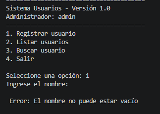
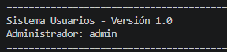
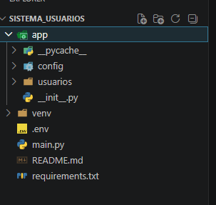

# Sistema Modular de Configuración y Gestión de Usuarios

## Descripción del Proyecto

Este proyecto consiste en una aplicación modular desarrollada en Python que permite gestionar usuarios desde consola.

El sistema fue creado aplicando conceptos de:

- Entornos virtuales
- Gestión de dependencias
- Variables de entorno
- Modularización
- Manejo de excepciones
- Validación de datos
- Organización profesional del código

El objetivo principal es demostrar buenas prácticas en el desarrollo de software utilizando Python.

---

# Objetivos del Proyecto

- Implementar un sistema modular organizado.
- Utilizar entornos virtuales para aislar dependencias.
- Gestionar dependencias mediante requirements.txt.
- Implementar variables de entorno usando python-dotenv.
- Aplicar validaciones y manejo de errores.
- Organizar el código usando módulos y paquetes.

---

# Tecnologías Utilizadas

- Python 3
- python-dotenv
- Git
- GitHub
- Visual Studio Code

---

# Estructura del Proyecto

```bash
sistema_usuarios/
│
├── app/
│   ├── __init__.py
│   │
│   ├── usuarios/
│   │   ├── __init__.py
│   │   ├── gestor.py
│   │   └── validaciones.py
│   │
│   └── config/
│       ├── __init__.py
│       └── settings.py
│
├── images/
│   ├── ejemplo1.png
│   ├── ejemplo2.png
│   ├── ejemplo3.png
│   ├── ejemplo4.png
│   └── ejemplo5.png
│
├── .env
├── .env.example
├── .gitignore
├── main.py
├── requirements.txt
└── README.md
```


---

# Explicación de la Estructura

## app/

Contiene toda la lógica principal del sistema.

---

## usuarios/

Contiene los módulos relacionados con la gestión de usuarios.

### gestor.py

Se encarga de:

- Registrar usuarios
- Listar usuarios
- Buscar usuarios

### validaciones.py

Se encarga de:

- Validar nombres
- Validar edades
- Generar excepciones personalizadas

---

## config/

Contiene configuraciones generales del sistema.

### settings.py

Se encarga de:

- Cargar variables de entorno
- Gestionar configuraciones globales

---

# Crear Entorno Virtual

## Windows

```bash
python -m venv venv
```

---

## Linux/Mac

```bash
python3 -m venv venv
```

---

# Activar Entorno Virtual

## Windows CMD

```bash
venv\Scripts\activate
```

---

## Git Bash

```bash
source venv/Scripts/activate
```

---

## Linux/Mac

```bash
source venv/bin/activate
```

---

# Instalación de Dependencias

## Instalar python-dotenv

```bash
pip install python-dotenv
```

---

# Generar requirements.txt

```bash
pip freeze > requirements.txt
```

---

# Instalar Dependencias desde requirements.txt

```bash
pip install -r requirements.txt
```

---

# Variables de Entorno

El proyecto utiliza variables de entorno para almacenar configuraciones importantes.

## Archivo .env

```env
APP_NAME=Sistema Usuarios
APP_VERSION=1.0
ADMIN_USER=admin
```

---

# Archivo .env.example

```env
APP_NAME=
APP_VERSION=
ADMIN_USER=
```

Este archivo sirve como plantilla para otros desarrolladores.

---

# Dependencias del Proyecto

## requirements.txt

```txt
python-dotenv==1.1.0
```

---

# Funcionamiento del Sistema

El sistema permite:

- Registrar usuarios
- Listar usuarios
- Buscar usuarios
- Validar nombres
- Validar edades
- Manejar errores mediante excepciones

---

# Ejecución del Proyecto

## Ejecutar aplicación

```bash
python main.py
```

---

# Menú Principal

```bash
========================================
Sistema Usuarios - Versión 1.0
Administrador: admin
========================================

1. Registrar usuario
2. Listar usuarios
3. Buscar usuario
4. Salir
```

---

# Ejemplo de Registro

```bash
Ingrese el nombre: Carlos
Ingrese la edad: 25

Usuario registrado correctamente
```

---

# Ejemplo de Error

```bash
Ingrese el nombre:
Error: El nombre no puede estar vacío
```

---

# Capturas del Proyecto

## 1. Creación del Entorno Virtual


---

## 2. Activación del Entorno Virtual


---

## 3. Instalación de Dependencias


---

## 4. Generación del requirements.txt


---

## 5. Ejecución del Sistema


---

## 6. Registro de Usuario


---

## 7. Listado de Usuarios


---

## 8. Búsqueda de Usuario


---

## 9. Validación de Errores



---

## 10. Uso de Variables de Entorno



---

## 11. Estructura del Proyecto en VS Code



---

# Modularización del Proyecto

La modularización permite dividir el proyecto en diferentes archivos especializados.

## Ventajas de modularizar

- Código más organizado
- Fácil mantenimiento
- Reutilización de funciones
- Mejor escalabilidad
- Separación de responsabilidades

---

# Uso de Entornos Virtuales

Los entornos virtuales permiten:

- Aislar dependencias
- Evitar conflictos entre proyectos
- Mantener versiones organizadas
- Facilitar despliegues

---

# Gestión de Dependencias

La gestión de dependencias se realizó utilizando:

- pip
- requirements.txt

También puede utilizarse:

- uv

---

# Uso Seguro de Variables de Entorno

Las variables de entorno ayudan a:

- Evitar exponer información sensible
- Centralizar configuraciones
- Mejorar seguridad
- Facilitar cambios de configuración

---

# Manejo de Excepciones

El sistema utiliza excepciones para controlar errores como:

- Nombres vacíos
- Edades inválidas
- Datos incorrectos

Ejemplo:

```python
raise ValueError("El nombre no puede estar vacío")
```

---

# Git y GitHub

## Inicializar repositorio

```bash
git init
```

---

## Agregar archivos

```bash
git add .
```

---

## Crear commit

```bash
git commit -m "Proyecto sistema modular"
```

---

# Reflexión Final

Este proyecto permitió comprender la importancia de organizar correctamente una aplicación en Python utilizando módulos y paquetes.

El uso de entornos virtuales facilita el manejo de dependencias y evita conflictos entre proyectos.

Las variables de entorno permiten manejar configuraciones de manera más segura y profesional.

La modularización mejora la legibilidad, mantenimiento y escalabilidad del software.

---
